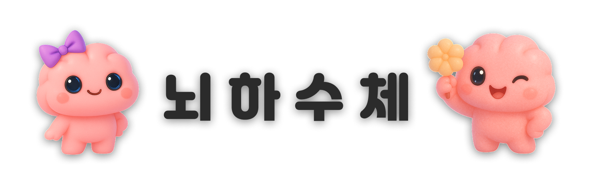

<div align="center">

<!-- logo -->


### 🧠 뇌하수체 – 체계적으로 즐기는 두뇌 피트니스

**뇌** 깨울 시간! **하**루 10분! **수** 많은 게임! **체**계적 두뇌 트레이닝!


</div>

<p align="center">
  <a href="https://github.com/LGTM-Team"></a>
  <a href="#"></a>
  <a href="#"></a>
</p>

---

## 📌 서비스 소개

**뇌하수체**는 집중력 저하, 기억력 감퇴를 겪는 20~40대 직장인 및 수강생을 위한 **웹 기반 두뇌 트레이닝 플랫폼**입니다.  
짧고 재미있는 게임을 통해 집중력을 향상시키고 두뇌를 활성화하는 것을 목표로 합니다.

---


## ✨배포된 서비스 링크
➡️ https://brain-game-dyyc.vercel.app/

---

## 🎯 주요 타겟

- 🧑‍💻 반복 업무에 지친 **직장인**
- 👩‍🎓 집중력 향상이 필요한 **개발자 취준생**
- 🧠 두뇌도 체계적으로 관리하고 싶은 **자기계발 지향 유저**
- 🎮 지루하지 않은 **재미있는 뇌게임**을 찾는 사람

---

## 🔧 주요 기능

### 🎮 1. 두뇌 훈련 게임
- **숫자를 외워라!**: 숫자의 위치와 순서를 기억해 순서대로 클릭하세요!

- **초성 퀴즈**: 주어진 초성으로 단어를 떠올려 빠르게 입력하세요!

- **색깔을 맞춰라!**: 글자 의미에 속지 말고, 색깔만 보고 정답을 맞춰주세요!

### 📊 2. 랭킹 시스템
- 게임 결과 기반 **랭킹 집계**

- **점수 변화 시각화 그래프**, 내 순위 강조

### 🧑‍💼 3. 회원 기능
- **회원가입** / **로그인** / **로그아웃** / **계정찾기** 지원

- **이메일 인증** 기반 보안 강화된 계정 관리

### 📢 4. 공지사항
- 새로운 게임, 이벤트, 업데이트 등 중요 **안내사항 제공**


### 📤 5. 게임 결과 공유
- 게임 종료 후 결과를 공유(**URL복사**, **카카오톡 공유**) 가능

- 친구들과 **랭킹 경쟁** 유도

### 📞 6. 고객센터
- 유저의 **피드백** 및 **버그 제보** 접수

- **관리자 응답** 및 **처리 내역** 확인 가능

---
## 📂 프로젝트 디렉토리 구조
<details>
<summary>📁 구조 펼쳐보기</summary>

```plaintext
src/
│
├── 🎨 assets/                      # 정적 자산 (이미지, 아이콘 등)
│   ├── icons/
│   └── images/
│       ├── account/
│       └── pages/
│           ├── error/
│           ├── game/
│           │   ├── numberGame/
│           │   └── tutorial/
│           ├── home/
│           └── notice/
│
├── 🧩 components/                  # 범용 UI 컴포넌트 (재사용 가능)
│   └── Button/
│       ├── Button.tsx
│       └── Button.module.css
│
├── 🪝 hooks/                       # 커스텀 훅
│   ├── useAllGames.ts
│   ├── useAllRankingData.ts
│   ├── useBonusScore.ts
│   ├── useCountdownTimer.ts
│   ├── useCurrentSession.ts
│   ├── useLogin.ts
│   ├── useMyRankingData.ts
│   ├── useNumberCardTransition.ts
│   ├── useNumberStep.ts
│   ├── usePasswordReset.ts
│   ├── useSaveScore.ts
│   ├── useSignUp.ts
│   └── useUpdateNickname.ts
│
├── 🧠 contexts/                    # React Context 모음
│   ├── AuthContext.tsx
│   └── KeyboardContext.tsx
│
├── 🧱 common/                      # 공통 컴포넌트
│   ├── form/
│   ├── layout/
│   ├── modals/
│   ├── post/
│   └── styles/
│
├── 📦 data/                        # 정적 JSON 데이터
│
├── 📂 pages/                      # 라우트 단위 페이지 구성
│   ├── Home/
│   ├── Games/
│   ├── Login/
│   ├── MyPage/
│   ├── FindAccount/
│   ├── NotFound/
│   ├── Notice/
│   └── Qna/
│
├── 🔌 api/                         # API 통신 모듈
│   └── service/
│       ├── notice/
│       ├── qna/
│       ├── auth/
│       ├── game/
│       └── supabase/
│
├── 🛠️ utils/                       # 공통 유틸 함수
│
├── 🗺️ router/                      # React Router 설정
│
├── 🎨 styles/                      # 전역 스타일 및 CSS 변수
│
├── 📐 types/                       # TypeScript 타입 정의
│
├── 🧮 App.tsx                      # 메인 앱 컴포넌트
├── 🚀 main.tsx                     # 앱 진입점
└── ⚙️ vite-env.d.ts                # Vite 환경 타입
```
</details>

---

## 🖥️ 기술 스택

### Front-end
<div style="text-align: start;">
  <div style="display: inline-block; margin: 8px; padding: 16px; border: 1px solid #ddd; border-radius: 12px; text-align: center; width: 100px; background: #fff;">
    <div style="height: 60px; display: flex; align-items: center; justify-content: center;">
      
    </div>
    <strong>TypeScript</strong>
  </div>
  <div style="display: inline-block; margin: 8px; padding: 16px; border: 1px solid #ddd; border-radius: 12px; text-align: center; width: 100px; background: #fff;">
    <div style="height: 60px; display: flex; align-items: center; justify-content: center;">
      
    </div>
    <strong>React</strong>
  </div>
  <div style="display: inline-block; margin: 8px; padding: 16px; border: 1px solid #ddd; border-radius: 12px; text-align: center; width: 100px; background: #fff;">
    <div style="height: 60px; display: flex; align-items: center; justify-content: center;">
      
    </div>
    <strong>Vite</strong>
  </div>
</div>

### Deployment & Backend
<div style="text-align: start;">
  <div style="display: inline-block; margin: 8px; padding: 16px; border: 1px solid #ddd; border-radius: 12px; text-align: center; width: 100px; background: #fff;">
    <div style="height: 60px; display: flex; align-items: center; justify-content: center;">
      
    </div>
    <strong>Vercel</strong>
  </div>
  <div style="display: inline-block; margin: 8px; padding: 16px; border: 1px solid #ddd; border-radius: 12px; text-align: center; width: 100px; background: #fff;">
    <div style="height: 60px; display: flex; align-items: center; justify-content: center;">
      
    </div>
    <strong>Supabase</strong>
  </div>
  <div style="display: inline-block; margin: 8px; padding: 16px; border: 1px solid #ddd; border-radius: 12px; text-align: center; width: 100px; background: #fff;">
    <div style="height: 60px; display: flex; align-items: center; justify-content: center;">
      
    </div>
    <strong>Resend</strong>
  </div>
</div>

### Tools
<div style="text-align: start;">
  <div style="display: inline-block; margin: 8px; padding: 16px; border: 1px solid #ddd; border-radius: 12px; text-align: center; width: 100px; background: #fff;">
    <div style="height: 60px; display: flex; align-items: center; justify-content: center;">
      
    </div>
    <strong>GitHub</strong>
  </div>
  <div style="display: inline-block; margin: 8px; padding: 16px; border: 1px solid #ddd; border-radius: 12px; text-align: center; width: 100px; background: #fff;">
    <div style="height: 60px; display: flex; align-items: center; justify-content: center;">
      
    </div>
    <strong>Notion</strong>
  </div>
  <div style="display: inline-block; margin: 8px; padding: 16px; border: 1px solid #ddd; border-radius: 12px; text-align: center; width: 100px; background: #fff;">
    <div style="height: 60px; display: flex; align-items: center; justify-content: center;">
      
    </div>
    <strong>Figma</strong>
  </div>
</div>

---
## 🎞️ 시연 영상
[](https://www.youtube.com/watch?v=_o4AmS7OlCA)

---

## 🤔 기술적 이슈 & 해결 과정

- **사전 데이터 확보**  
  [[초성 퀴즈] 단어 필터링 스크립트 만들기 (출처: Notion)](https://www.notion.so/230a46ddb60c80ee9b61cc25ef97417d)

- **한글 초성 추출 및 유효성 검사**  
  [[초성 퀴즈] 한글 초성 추출하기 (출처: Notion)](https://www.notion.so/23aa46ddb60c805ea651d327d4a218fb)


---

## 🧑‍🤝‍🧑 프로젝트 팀원

| Frontend | Frontend | Frontend |
|--------|----------|----------|
|  |  |  |
| [백효영](https://github.com/HyoYoung0829) | [김정주](https://github.com/KimJJRoSY) |[정소영](https://github.com/Young-mang) |

---
